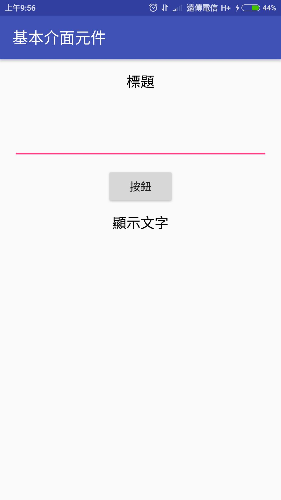

# Android workshop (NCU)
## Folder
1. res - resource
 - drawable mipmap 圖檔
 - layout 畫面
 - value 設值
2. Mainfest

## Framwork
1. Activity
 - OnCreate()
 - setContentView()
 - id
 - findViewById()
2. Interface
 - id, text, layout_width, layout_height
3. RelativeLayout
 - parent container
4. TableLayout
5. TextView
6. EditText
7. Button
 - use id to find whitch button
8. Actionlistener

## Shot
1. Example 1

2. Exercise 1
